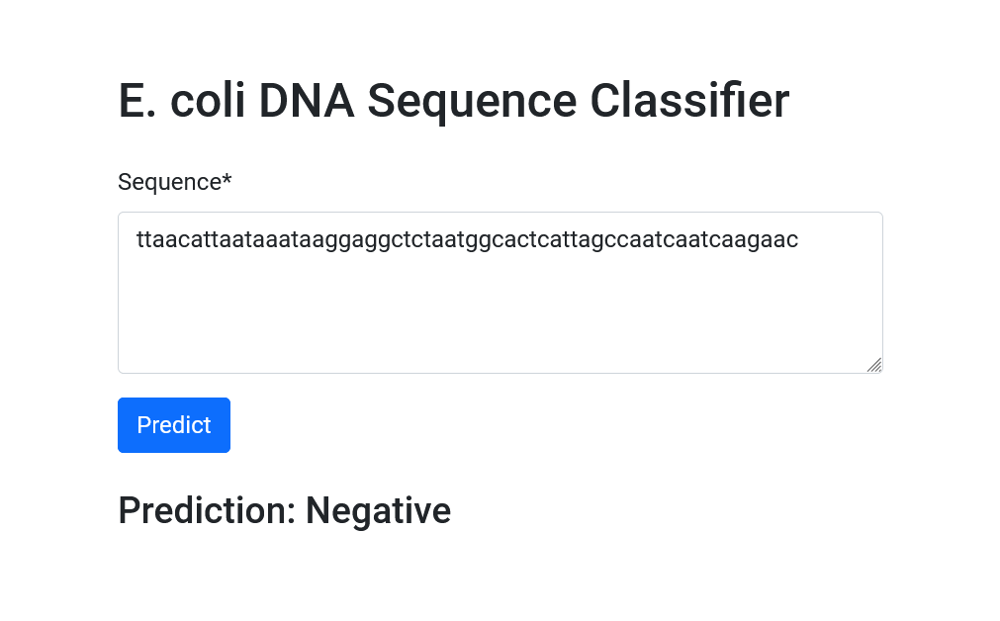

# E. coli DNA Sequence Classifier



## Project Overview

The E. coli DNA Sequence Classifier is a machine learning project that predicts whether a given DNA sequence belongs to the E. coli bacteria. This project uses a Multi-Layer Perceptron (MLP) classifier to make predictions and provides a user-friendly web interface built with Django, allowing users to input DNA sequences and receive instant classification results.

The classifier is based on the E. coli promoter gene sequences dataset from the UCI Machine Learning Repository. This dataset contains DNA sequences of promoter and non-promoter regions, making it suitable for binary classification tasks in bioinformatics.

This project demonstrates the application of machine learning in creating a practical tool for biologists and researchers. It serves as an excellent example of an end-to-end data science project, from data preprocessing and model training to deploying a web application with Docker compatibility.

## Table of Contents

1. [Dataset](#dataset)
2. [Model Training](#model-training)
3. [Django Application](#django-application)
4. [Deployment Options](#deployment-options)
5. [File Structure](#file-structure)
6. [Usage](#usage)

## Dataset

The E. coli promoter gene sequences dataset includes the following key attributes:

1. DNA sequence
2. Class (promoter or non-promoter)

The dataset can be downloaded from the [UCI Machine Learning Repository](https://archive.ics.uci.edu/ml/datasets/molecular+biology+(promoter+gene+sequences)).

## Model Training

The model training process is detailed in the `E_Coli_Classification.ipynb` notebook. This notebook covers data preprocessing, exploratory data analysis, and the implementation of the Multi-Layer Perceptron (MLP) classifier for DNA sequence classification.

## Django Application

The Django application is defined in the `ecoli_project` directory. It provides a user interface for inputting DNA sequences and viewing the predicted classification.

## Deployment Options

There are three main ways to deploy and use this application:

1. **Run Locally**:
   - Clone the repository:
     ```
     git clone https://github.com/pouryare/ecoli-dna-classification.git
     cd ecoli-dna-classification
     ```
   - Create a virtual environment: 
     ```
     python -m venv venv
     source venv/bin/activate  # On Windows use `venv\Scripts\activate`
     ```
   - Install requirements: `pip install -r requirements.txt`
   - Navigate to the Django project directory: `cd ecoli_project`
   - Run migrations: `python manage.py migrate`
   - Run the Django development server: `python manage.py runserver`
   - Open a web browser and go to `http://localhost:8000`

2. **Build and Run Docker Image Locally**:
   - Install [Docker](https://docs.docker.com/get-docker/) on your machine.
   - Build the Docker image: 
     ```
     docker build -t ecoli-classifier .
     ```
   - Run the container: 
     ```
     docker run -p 8000:8000 ecoli-classifier
     ```
   - Open a web browser and go to `http://localhost:8000`

3. **Use Pre-built Docker Image**:
   - Pull the pre-built image from Docker Hub:
     ```
     docker pull pouryare/ecoli-classifier:latest
     ```
   - Run the container:
     ```
     docker run -p 8000:8000 pouryare/ecoli-classifier:latest
     ```
   - Open a web browser and go to `http://localhost:8000`

## File Structure
```
ecoli-classifier/
├── ecoli-classifier/
│   ├── ecoli_project/
│   │   ├── __init__.py
│   │   ├── settings.py
│   │   ├── urls.py
│   │   └── wsgi.py
│   ├── classifier/
│   │   ├── __init__.py
│   │   ├── admin.py
│   │   ├── apps.py
│   │   ├── models.py
│   │   ├── views.py
│   │   ├── urls.py
│   │   └── templates/
│   │       └── classifier/
│   │           └── predict.html
│   ├── static/
│   ├── manage.py
│   ├── Dockerfile
│   └── requirements.txt
├── E_Coli_Classification.ipynb
├── README.md
└── screenshot.png
```

## Usage

1. Open the application (either locally or on a deployed platform).
2. Enter a DNA sequence in the input field provided.
3. Click the "Predict" button to view the classification result.

---

This project demonstrates the application of machine learning in creating an E. coli DNA sequence classification tool with a web application interface and Docker compatibility. It serves as an excellent example of an end-to-end data science project with practical applications in bioinformatics and molecular biology.

For any issues or suggestions, please open an issue on the [GitHub repository](https://github.com/pouryare/ecoli-dna-classification).
